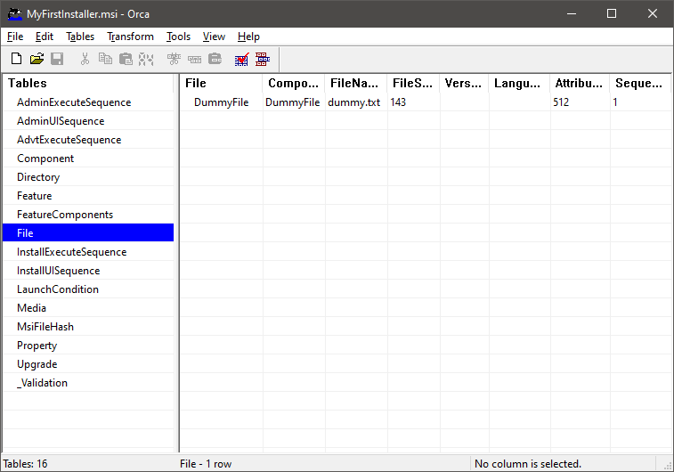
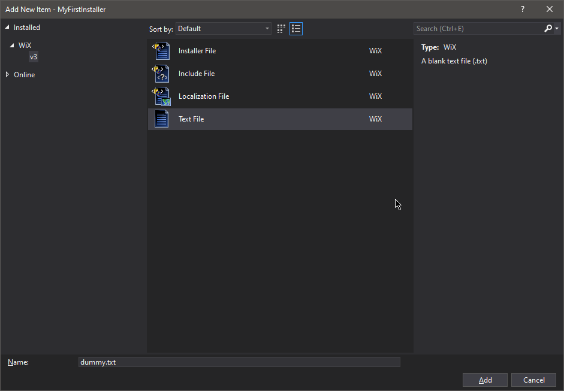
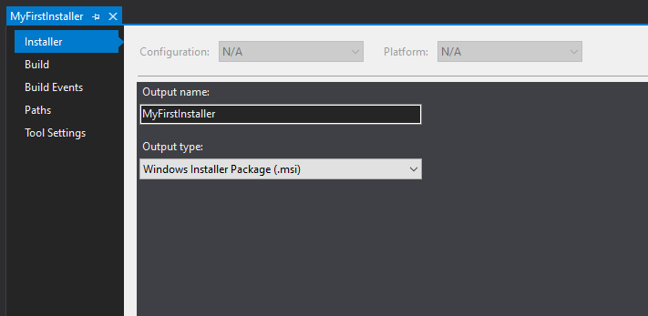
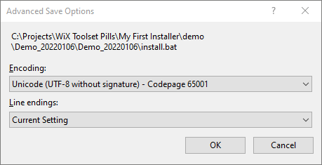
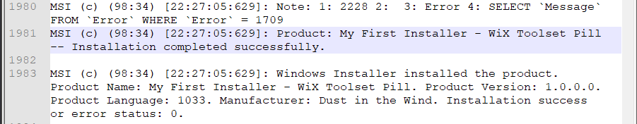
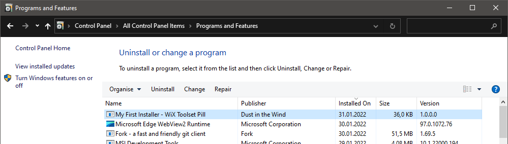
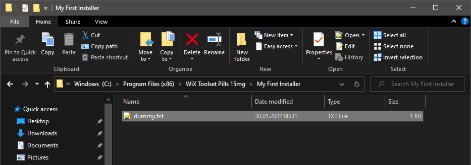
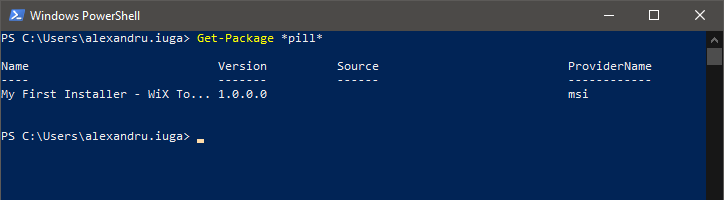
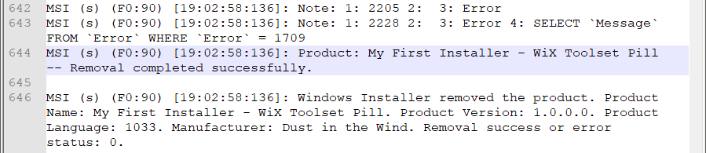

# My First Installer

In this tutorial we will:

- Create a new WiX Project.
- Define a hierarchy of directories where components will be installed.
- Create `Feature` -> `Component` -> `File` elements to include a text file that will be deployed in the
      target directory at install time.
- Install/Uninstall the MSI.

## Before we begin - Windows Installer, MSI files and WiX Toolset

Before we start, I think it would be useful to have a few words about these three concepts:

### a) Windows Installer

Before the 2000s, Microsoft created for Windows a centralized mechanism to handle the application's installation process and keep track of those installed applications. They called it "Windows Installer".

### b) The MSI file

An MSI file is a database, containing tables with all the necessary data needed to install/uninstall/repair an application. We have there all kinds of information like application's name, version, the default path where to be installed, the list of actions to be executed at install time etc. The actual binary files that should be deployed are also packed inside this database. Note that, optionally, we may decide to pack those files in separate cab packages.

This MSI file is not an executable. When double clicked, windows opens this database with the `msiexec.exe` application and executes all the actions specified inside that MSI database. For more details regarding the custom actions and the order of execution, see the pills:

- "Immediate Custom Action" - https://github.com/WiX-Toolset-Pills-15mg/Immediate-Custom-Action
- "Deferred Custom Action" - https://github.com/WiX-Toolset-Pills-15mg/Deferred-Custom-Action

### c) Orca

An MSI file can be opened and modified using the Orca tool provided by Microsoft as part of the Windows SDK.

To install Orca:

- Download the Windows SDK from here: https://developer.microsoft.com/en-us/windows/downloads/windows-sdk/
- Mount the iso file by double clicking it.
- Run the `\installers\Orca-x86_en-us.msi` installer.

Open Orca and load any MSI file. In the left you will find a list with all the tables present in this MSI. When selecting a table, in the right part you will see the records from that table.



### d) WiX Toolset

One way to create an MSI is to use Orca and modify, by hand, all the data in there. Another way, is to use WiX Toolset.

WiX Toolset is a set of tools that helps you to generate an MSI installer:

-  You, as a developer, are required to describe in an xml file everything that you want the MSI to contain.
- Then, at build time, WiX Toolset will generate the MSI based on those specifications. This is done by two internal tools called:
  - `lite.exe` (the linker) - https://wixtoolset.org/documentation/manual/v3/overview/light.html
  - `candle.exe` (the compiler) - https://wixtoolset.org/documentation/manual/v3/overview/candle.html

**Note**: Don't mistake "WiX Toolset" for "Wix" the web platform that is used for creating websites.

## Prerequisites

Before anything, WiX Toolset must be installed and integrated with Visual Studio.

Install **WiX Toolset build tools** and the **Visual Studio extension** from `https://wixtoolset.org/releases/`:


**Note**: WiX Toolset can be used also independently of Visual Studio, from command line, but we'll use the Visual Extension in this tutorial.

## Step 1: Create a new WiX project

In Visual Studio create a new "Setup Project for WiX v3" project:


The template contains a single `Product.wxs` file that is, actually, an xml file. This file describes the desired content that the MSI should contain.

When we open the file we find:

- A `<Product>` tag that contains the description of the product;
- A `<Fragment>` tag that contains the directory structure used by the MSI's components;
- A second `<Fragment>` tag that contains the list of components that the MSI will install;

```xml
<?xml version="1.0" encoding="UTF-8"?>
<Wix xmlns="http://schemas.microsoft.com/wix/2006/wi">
	<Product ...>
		...
	</Product>

	<Fragment>
		<Directory ...
	</Fragment>

	<Fragment>
		<ComponentGroup ...
	</Fragment>
</Wix>
```

**Suggestion**: I strongly suggest to keep in this file only the `<Product>` tag and to extract the other two fragments into separate files. We'll discuss about this in details later in this tutorial. refers  

## Step 2: The Product

The `<Product>` tag is the main tag of the WiX project. It contains directly or refers everything that the resulted MSI file will contain. When you read a WiX project, you should start from the `<Product>` tag.

The first aspects that may capture your attention are the name of the product and the manufacturer. They are provided as attributes of the `<Product>` element:

```xml
<Product
	Id="*"
    Name="My First Installer - WiX Toolset Pill"
    Language="1033"
    Version="1.0.0.0"
    Manufacturer="Dust in the Wind"
	UpgradeCode="1005fc0e-c562-4498-9196-aa6fdd5f4e62">
    
    ...
    
</Product>
```

The version may also be interesting, but, for the first installer that we are creating, we will keep it at "1.0.0.0".

Some other xml tags are generated, but we may safely leave them, for now, as they are. No need to change them: `<Package>`, `<MajorUpgrade>`, `<MediaTemplate>`:

```xml
<Product
	Id="*"
	Name="My First Installer - WiX Toolset Pill" 
    Language="1033" 
    Version="1.0.0.0"
    Manufacturer="Dust in the Wind"
    UpgradeCode="1005fc0e-c562-4498-9196-aa6fdd5f4e62">
    
    <Package
		InstallerVersion="200"
        Compressed="yes"
        InstallScope="perMachine" />

    <MajorUpgrade DowngradeErrorMessage="A newer version of [ProductName] is already installed." />
    <MediaTemplate />

    ...
    
</Product>
```

## Step 3: The Features

The `<Feature>` tag, though, may need some explanations.

```xml
<Product
	Id="*"
    Name="My First Installer - WiX Toolset Pill" 
    Language="1033" 
    Version="1.0.0.0"
    Manufacturer="Dust in the Wind"
    UpgradeCode="1005fc0e-c562-4498-9196-aa6fdd5f4e62">

    ...

    <Feature
		Id="ProductFeature"
        Title="Deploy Files"
        Level="1">
        
        <ComponentGroupRef Id="FileComponents" />
    </Feature>

</Product>
```

The smalles unit of installation in Windows Installer is a Component. There may be huntreds or thousends of components into an installer. These components can be logically groupped into Features.

At install time, the user is allowed to decide which features to be installed. The feature is the smalles unit that the user can select for installation. For example, we may want to have a mandatory feature that installs the application's main files and other optional features that install language packs.

If the installer has a UI, it may include a page where the user can select the features to be installed. the `Title` attribute contains the text displayed in the UI as label for the feature. If there is no UI, the user may still choose the features from command line. See the [Multiple Features](https://github.com/WiX-Toolset-Pills-15mg/Multiple-Features) pill for more details.

The current installer has only one feature and no UI. This only feature will be automatically installed. The `Level` attribute should be set to `1` to enable the installation of this feature by default.

## Step 4: The Components

As we already said, a feature, usually contains many components and can easily handle thousands of them. They are the smallest unit managed and tracked by the installer. It is suggested to create one component for each file in order for the installer to correctly track them and be repair them when needed.

Components can exist individually or grouped in `<ComponentGroup>` tags. The `<ComponentGroup>` tag is a WiX Toolset concept, it will not be found in the final MSI. Instead, each component from the group is individually added directly into the parent feature. The group is there for us, the developers, to easier reference multiple components in code.

In our example, the `ComponentGroup` is extracted in another file and, in the `Feature` tag we reference it using the `<ComponentGroupRef>` tag.

```xml
<Feature
	Id="ProductFeature"
    Title="Deploy Files"
    Level="1">

    <ComponentGroupRef Id="FileComponents" />
</Feature>
```

We'll describe the `FileComponents` later in this tutorial.

```xml
<ComponentGroup Id="FileComponents" Directory="INSTALLFOLDER">
    ...
</ComponentGroup>
```

## Step 5: The Directory Structure

In our example, the `<ComponentGroup>` specifies a directory. Each component must have an associated directory. If the `<ComponentGroup>` tag specifies the directory it will be assigned to all the components in the group and it is not needed to explicitly specify it to each component.

**Suggestion**: To improve the readability of the WiX file, I consider a good practice to define the installation directories in a separate file. For this, we will create a new wxs file and move the entire `<Fragment>` containing the directory structure into this file.

```xml
<?xml version="1.0" encoding="UTF-8"?>
<Wix xmlns="http://schemas.microsoft.com/wix/2006/wi">
    <Fragment>

        <Directory Id="TARGETDIR" Name="SourceDir">
            <Directory Id="ProgramFilesFolder">
                <Directory Id="PillsDirectory" Name="WiX Toolset Pills 15mg">
                    <Directory Id="INSTALLFOLDER" Name="My First Installer - WiX Toolset Pill" />
                </Directory>
            </Directory>
        </Directory>

    </Fragment>
</Wix>
```

### The `TARGETDIR`

The element with the id `TARGETDIR` is required by the Windows Installer and is the root of all directory structures of the installation. Every WiX project needs to have this directory element.

### The `ProgramFilesFolder`

The Program Files directori is referenced only by `Id`. It has no explicitly specified name. The actual name is provided by the Windows operating system at install time.

### The `PillsDirectory`

Next, we may add other custom directories. In this tutorial we added the `WiX Toolset Pills 15mg` directory that can be referenced in the installer by the `PillsDirectory` id. All the pills from this series will be installed in this directory, for consistency.

#### The `INSTALLFOLDER` 

The `INSTALLFOLDER` is another important directory. This is the root directory where the product will be installed. The id is in all capital letters to make it a public property that can be from the command line.

**Important**: Just by specifying the directories here, the installer will not really create them on the disk. They are created only as a consequence of deploying files in that location. If no file is deployed, no directory is created.

**Suggestion**: WiX Toolset allows to add components directly into the `Directory` structure. I suggest to never do this. I prefer to keep this structure short, clean and easy to understand. The comnponents will be configured later in another wxs file and will reference these directories by id.

## Step 6: Create the `dummy.txt` file

Add a text file into the project, called "dummy.txt". This will be the file packed into the MSI and deployed at install time on the target machine.

- Right click on project -> Add -> New Item -> Text File -> dummy.txt



add any content you want into this file.

## Step 7: Adding Files to the Installer

The next step would be to specify the files that need to be deployed by the installer. As with the directories fragment, let's move this fragment in a separate file:

```xml
<?xml version="1.0" encoding="UTF-8"?>
<Wix xmlns="http://schemas.microsoft.com/wix/2006/wi">
    <Fragment>

        <ComponentGroup Id="FileComponents" Directory="INSTALLFOLDER">
            <Component Id="DummyFileComponent">
                <File Id="DummyFile" Source="$(var.ProjectDir)dummy.txt" KeyPath="yes" />
            </Component>
        </ComponentGroup>

    </Fragment>
</Wix>
```

The files are added into the installer by creating components. It is a good practice to add only one resource (like a file, a registry entry, a shortcuts, etc) into a component.

Every component must have its own unique GUID. If it is not specified explicitly, one is generated at build time.

**Important**: In general, you should restrict yourself to a single file per component. The Windows Installer is designed to support thousands of components in a single installer, so unless you have a very good reason, keep to one file per component. This is because WiX keeps track of only one thing, in this case file, per component. In the repair flow, only the main resource of the component can be restored.

**Note**: The main file of the component is specified by the `KeyPath` attribute.

Let's discuss the example.

### Add the component group to the a feature

An id, in our example `FileComponents`, is needed to allow us to reference it back from the `<Features>` tag. Remember that, each component or component group must be added to a feature in order to be included in the MSI installer:

```xml
<Product ...>
    ...
    
    <Feature
		Id="ProductFeature"
        Title="Deploy Files"
        Level="1">
        
        <ComponentGroupRef Id="FileComponents" />
    </Feature>
    
</Product>
```

### The component's directory

Each component or component group must have a base directory where it is installed. This is specified by the `Directory` attribute. In our example, the directory of the component group is the one with the id `INSTALLFOLDER`. See the `Directories.wxs` file for details regarding where on the disk will be this directory created.

```xml
<ComponentGroup Id="FileComponents" Directory="INSTALLFOLDER">
    ...
</ComponentGroup>
```

### The file's source location

This is the path where the file is located on your machine at compile time. WiX will take the file from there and pack it into the MSI.

In our case, because the file is included in our Visual Studio project, we are able to use the `var.ProjectDir` variable to specify the file location relative to the root path of the project.

```xml
<File Id="DummyFile" Source="$(var.ProjectDir)dummy.txt" KeyPath="yes" />
```

### The `KeyPath`

The `KeyPath` attribute is set to yes to tell the Windows Installer that this is the main resource of the component. It is used to identify if the component is installed or not. If you do not set the `KeyPath` attribute explicitly, WiX will look at the child elements under the component in sequential order and try to automatically select one of them as a key path.

Allowing WiX to automatically select a key path can be dangerous because adding or removing child elements under the component can inadvertently cause the key path to change, which can lead to installation problems.

In general, you should always set the `KeyPath` attribute to `yes` to ensure that the key path will not inadvertently change if you update your setup authoring in the future.

**Note**: The `Checksum` attribute should also be set to `yes` for executable files that have a checksum value in the file header (this is generally true for all executables). It is used by the Windows Installer to verify the validity of the file on re-install.

## Step 8: The MSI's Name

Next, let's choose a name for the MSI file:

- Right click on the project -> Properties -> Output name



By default, the MSI's name is the same as the project's name, but, if you like, it can be changed from here.

## Step 9: Create the install/uninstall scripts

### a) Add the install script

- Right click on project -> Add -> New Item -> Text File -> install.bat

```
msiexec /i MyFirstInstallerKata.msi /l*vx install.log
```

### b) Remove BOM

**Note**: Because the WiX Toolset template for a text file is in UTF-8 with BOM (Byte Order Mark) format, the created `.bat` file will crush when executed. We must remove the BOM first:

- Select `install.bat` file -> File -> Save install.bat As... -> right click on the drop-down of the Save button -> Save with Encoding... -> "Yes" to replace the file -> Encoding dropdown -> "Unicode (UTF-8 without signature) - Codepage 65001" -> OK



See Wikipedia for details about UTF-8 with BOM: https://en.wikipedia.org/wiki/Byte_order_mark

**Note**: The BOM can be also removed using Notepad++ or other tools.

### c) Add the uninstall script

Adding the `uninstall.bat` file is similar to adding the `install.bat` script with two differences:

- The file name should be `uninstall.bat`

- The content of the file is:

  ```
  msiexec /x MyFirstInstallerKata.msi /l*vx uninstall.log
  ```

**Note**: Don't forget about the BOM.

## Step 10) Add post-build event to deploy the scripts

The `.bat` files must be copied into the target directory after the project is built. We can automate this using post-build events:

- Right click on project -> Properties -> Build Events -> Post-build Event Command Line

```
xcopy /y "$(ProjectDir)*.bat" "$(TargetDir)"
```

## Step 11) Build the project

Build the project:

- Solution Explorer -> Right click the solution -> Build Solution
- OR: Top Manu -> Build -> Build Solution
- OR: Ctrl+Shift+B

## Step 12: Install

Go into the `bin\Debug` or `bin\Release` directory, depending on the build configuration used, and run the `install.bat` file.

In the `install.log` file, at the end, we can find the successful message:



In the control panel we can find the installed product:



The dummy file is deployed in the installation directory:



In PowerShell:

```powershell
PS Get-Package *pill*
```



## Step 13: Uninstall

Similarely, for uninstalling the product, run the `uninstall.bat` script and look into the `uninstall.log` file:



## Final notes

### Did you installed and then lost the MSI file?

In the developing process, you may find yourself in the situation in which you installed the MSI and then, when rebuilding the solution, you discover you are not able to uninstall the previous one because you lost the original MSI file (overwritten by the new one). Don't panic.

Go to "Control Panel" -> "Programs and Features" and uninstall it from there. By default, Windows keeps a copy of the original MSI file for all the installer products.
