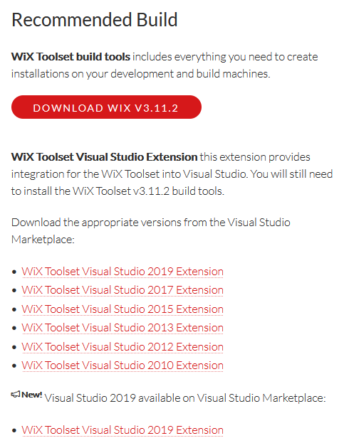
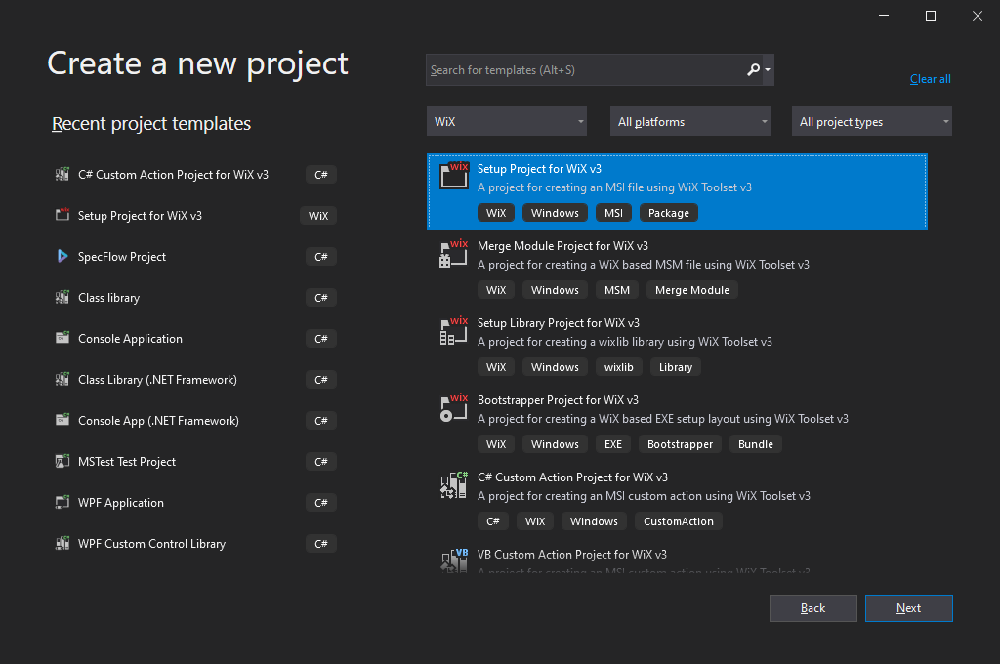

# My First Installer

In this tutorial we will:

- Create a new WiX Project.
- Configure a directory structure to be created on the target machine when installer is run.
- Provide a text file to be deployed in the target directory.

## Before we begin - Windows Installer, MSI files and WiX Toolset

Before we start, I think it would be useful to have a few words about these three concepts:

### a) Windows Installer

Before the 2000s, Microsoft created for Windows a centralized mechanism to handle the application's installation process and keep track of those installed applications. They called it "Windows Installer".

### b) An MSI file

An MSI file is a database, containing tables with all the necessary data needed to install/uninstall/repair an application. We have there all kinds of information like application's name, version, the default path where to be installed, the list of actions to be executed at install time etc. The actual binary files that should be deployed are also packed inside this database. Note that, optionally, we may decide to pack those files in separate cab packages.

This MSI file is not an executable. When double clicked, windows opens this database with the `msiexec.exe` application and executes all the actions specified inside that MSI database. For more details regarding the custom actions and the order of execution, see the pills:

- "Immediate Custom Action" - https://github.com/WiX-Toolset-Pills-15mg/Immediate-Custom-Action
- "Deferred Custom Action" - https://github.com/WiX-Toolset-Pills-15mg/Deferred-Custom-Action

### c) Orca

An MSI file can be opened and modified using the Orca tool provided by Microsoft as part of the Windows SDK.

To install Orca:

- Download the Windows SDK from here: https://developer.microsoft.com/en-us/windows/downloads/windows-sdk/
- Mount the iso file by double clicking it.
- Run the `\installers\Orca-x86_en-us.msi` installer.

Open Orca and load an MSI file. In the left you will find a list with all the tables present in this MSI. When selecting a table, in the right part you will see the records present in that table.


### c) WiX Toolset

One way to create an MSI is to use Orca and modify, by hand, all the data in there. Another way, is to use WiX Toolset.

WiX Toolset is a set of tools that helps you to generate an MSI installer:

-  You, as a developer, are required to describe in an xml file everything that you want the MSI to contain.
- Then, at build time, WiX Toolset will generate the MSI based on those specifications. This is done by two internal tools called:
  - `lite.exe` (the linker) - https://wixtoolset.org/documentation/manual/v3/overview/light.html
  - `candle.exe` (the compiler) - https://wixtoolset.org/documentation/manual/v3/overview/candle.html

**Note**: Don't mistake "WiX Toolset" for "Wix" the web platform that is used for creating websites.

## Prerequisites

Before anything, WiX Toolset must be installed and integrated with Visual Studio.

Install **WiX Toolset build tools** and the **Visual Studio extension** from `https://wixtoolset.org/releases/`:



**Note**: WiX Toolset can be used also independently of Visual Studio.

## Step 1: Create a new WiX project

In Visual Studio create a new "Setup Project for WiX v3" project:



The template contains a single `Product.wxs` file that is, actually an xml file. This file contains the description for the MSI that we want to create.

When we open the file we find:

- A `<Product>` tag that contains the description of the product;
- A `<Fragment>` tag that contains the directory structure we want to be created by the MSI;
- A second `<Fragment>` tag that contains the list of components that the MSI will install;

```xml
<?xml version="1.0" encoding="UTF-8"?>
<Wix xmlns="http://schemas.microsoft.com/wix/2006/wi">
	<Product ...>
		...
	</Product>

	<Fragment>
		<Directory ...
	</Fragment>

	<Fragment>
		<ComponentGroup ...
	</Fragment>
</Wix>
```

**Suggestion**: I strongly suggest to keep in this file only the `<Product>` tag and to extract the other two fragments into separate files. We'll discuss about this in details later in this tutorial.

## Step 2: The Product

The `<Product>` tag is the main section of the WiX project. When you read a WiX project, you should start from the `<Product>` tag.

The first aspects that may capture your attention are the name of the product and the manufacturer. They are provided as attributes of the `<Product>` element:

```xml
<Product Id="*" Name="My First Installer - WiX Toolset Pill" Language="1033" Version="1.0.0.0"
         Manufacturer="Dust in the Wind" UpgradeCode="1005fc0e-c562-4498-9196-aa6fdd5f4e62">
    ...
</Product>
```

The version may also be interesting, but for the first installer that we are creating, we will keep it at "1.0.0.0".

Some other xml tags are generated, but we may safely leave them, for now, as they are. No need to change them: `<Package>`, `<MajorUpgrade>`, `<MediaTemplate>`:

```xml
<Product Id="*" Name="My First Installer - WiX Toolset Pill" Language="1033" Version="1.0.0.0"
         Manufacturer="Dust in the Wind" UpgradeCode="1005fc0e-c562-4498-9196-aa6fdd5f4e62">
    
    <Package InstallerVersion="200" Compressed="yes" InstallScope="perMachine" />

    <MajorUpgrade DowngradeErrorMessage="A newer version of [ProductName] is already installed." />
    <MediaTemplate />

    ...
</Product>
```

### The Features

The `<Feature>` tag, though, may need some explanation.

```xml
<Product Id="*" Name="My First Installer - WiX Toolset Pill" Language="1033" Version="1.0.0.0"
         Manufacturer="Dust in the Wind" UpgradeCode="1005fc0e-c562-4498-9196-aa6fdd5f4e62">

    ...

    <Feature Id="ProductFeature" Title="Deploy Files" Level="1">
        <ComponentGroupRef Id="FileComponents" />
    </Feature>

</Product>
```

A feature is the smallest unit that the user can decide, at install time, to install or not. For example, we may want to have a mandatory feature that installs the application's main files and other optional features that install language packs.

A `<Feature>` element may pack multiple components that are installed together as a logical unit. If the installer has a UI, the user may be requested to select the features to be installed. the `Title` attribute contains the text displayed in the UI as label for the feature.

The current installer has only one feature and no UI. This only feature will be automatically installed. The `Level` attribute should be set to 1 to enable the installation of this feature by default.

### Components

If we talked about features it's only fair to say a few words about components.

A feature, usually contains many components and can easily handle thousands of them. They are the smallest unit managed and tracked by the installer. It is suggested to create one component for each file that needs to be installed.

Components can exist individually or grouped in `<ComponentGroup>`s.

Even if they can be added directly into the `<Feature>` tag, I suggest grouping components using `<ComponentGroup>`s and moving them in separate files. Give those files suggestive names to easily know what they contain. Then add the component group into the `<Feature>` tag as a reference as it is shown in the above example with the `FileComponents`. We'll describe the `FileComponents` later in this tutorial.

## Step 3: Directory structure

Next, let's describe the directory structure that we need to be created on the target machine, when the installer is executed.

**Suggestion**: To improve the readability of the WiX file, I consider a good practice to define the installation directories in a separate file. For this, we will create a new wxs file and move the entire `<Fragment>` containing the directory structure into this file.

```xml
<?xml version="1.0" encoding="UTF-8"?>
<Wix xmlns="http://schemas.microsoft.com/wix/2006/wi">
    <Fragment>

        <Directory Id="TARGETDIR" Name="SourceDir">
            <Directory Id="ProgramFilesFolder">
                <Directory Id="ManufacturerFolder" Name="Dust in the Wind">
                    <Directory Id="INSTALLFOLDER" Name="My First Installer - WiX Toolset Pill" />
                </Directory>
            </Directory>
        </Directory>

    </Fragment>
</Wix>
```

**Note**: The `<Wix>` element must be kept as the root element in this file, too.

The element with the id `TARGETDIR` is required by the Windows Installer and is the root of all directory structures of the installation. Every WiX project needs to have this directory element.

Next directory is the one having the `ProgramFilesFolder` id. It has no name. The actual name is provided by the Windows operating system at install time.

Next, we may add other custom directories. In this tutorial we added the `Dust in the Wind` directory that can be referenced in the installer by the `ManufacturerFolder` id.

The `INSTALLFOLDER` is another important directory. This is the root directory where the product will be installed. The id is in all capital letters to make it a public property that can be set from UI or via the command line.

**Important**: Just by specifying the directories here, the installer will not really create them empty on the disk. Only files are created by the installer. We need to describe the directory hierarchy here only to be able to reference them later, by id, when we configure the files. See the next step.

**Suggestion**: Even if WiX allows it, I suggest to never add files directly in this structure. I prefer to keep this structure short, clean and easy to understand. The files will be configured later in another wxs file and will reference these directories by id.

## Step 4: Components - Adding files to the installer

The next step would be to specify the files that need to be deployed by the installer. As with the directories fragment, let's to move this fragment in a separate file:

```xml
<?xml version="1.0" encoding="UTF-8"?>
<Wix xmlns="http://schemas.microsoft.com/wix/2006/wi">
    <Fragment>

        <ComponentGroup Id="FileComponents" Directory="INSTALLFOLDER">
            <Component>
                <File Id="DummyFile" Source="$(var.ProjectDir)dummy.txt" KeyPath="yes" />
            </Component>
        </ComponentGroup>

    </Fragment>
</Wix>
```

The files are added into the installer by creating components. Lots of components. Each component usually contain one resource like a file, a registry entry, a shortcuts, etc.

Every component must have its own unique GUID. If it is not specified explicitly, one is generated at build time.

**Important**: In general, you should restrict yourself to a single file per component. The Windows Installer is designed to support thousands of components in a single installer, so unless you have a very good reason, keep to one file per component. This is because WiX keeps track of only one thing, in this case file, per component. In the repair flow, only the main file of the component can be restored.

**Note**: The main file of the component is specified by the `KeyPath` attribute.

Let's discuss the example.

### Add the component to the a feature

An id, in our example `FileComponents`, is needed to be able reference it back from the `<Features>` tag. Remember that, each component or component group must be added to a feature:

```xml
<Product ...>
    ...
    
    <Feature Id="ProductFeature" Title="Deploy Files" Level="1">
        <ComponentGroupRef Id="FileComponents" />
    </Feature>
    
</Product>
```

### The component's directory

Each component or component group must have a base directory where it is installed. This is specified by the `Directory` attribute. In our example, the directory of the component group is the one with the id `INSTALLFOLDER`. See the `Directories.wxs` file for details regarding where on the disk will be this directory created.

### The file's source location

This is the path where the file is located on your machine at compile time. WiX will take the file from there and pack it into the MSI.

In our case, because the file is included in our Visual Studio project, we are able to use the `var.ProjectDir` variable to specify the file location relative to the root path of the project.

### The `KeyPath`

The `KeyPath` attribute is set to yes to tell the Windows Installer that this particular file should be used to determine whether the component is installed or not. If you do not set the `KeyPath` attribute explicitly, WiX will look at the child elements under the component in sequential order and try to automatically select one of them as a key path.

Allowing WiX to automatically select a key path can be dangerous because adding or removing child elements under the component can inadvertently cause the key path to change, which can lead to installation problems.

In general, you should always set the `KeyPath` attribute to `yes` to ensure that the key path will not inadvertently change if you update your setup authoring in the future.

**Note**: The `Checksum` attribute should also be set to `yes` for executable files that have a checksum value in the file header (this is generally true for all executables). It is used by the Windows Installer to verify the validity of the file on re-install.

## Step 5: The MSI's Name

The last thing remaining to be done is to choose a name for the MSI file:

- Right click on the project -> Properties -> Output name


## Step 6: Done

Build and then install :)

**Note**: The source code example provides to files called `install.bat` and `uninstall.bat` that, even if they are configured in the project to be automatically deployed in the output (`bin/Release`) directory, they are not actually deployed. If you need them, please copy them by hand there.

## Other Important notes

### Did you installed and lost the MSI file?

If, in the developing process, it happens that you install an MSI and then, after a rebuild, you discover you are not able to uninstall the previous version because you lost the original MSI file (overwritten by the new one), don't panic.

Go to Control Panel -> Programs and Features and uninstall it from there. By default, Windows keeps a copy of the original MSI file.
