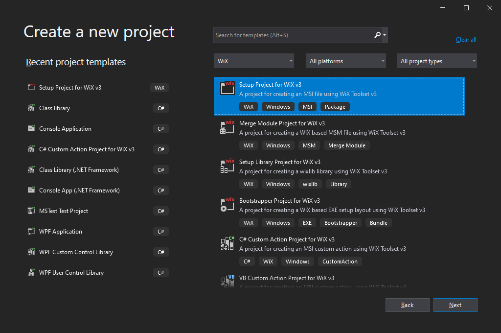

# My First Installer - Kata

## Preface

From Wikipedia:

> ***Kata*** is a Japanese word  (型 or 形) meaning "form". It refers to a detailed choreographed pattern of martial arts movements made to be practised alone. [...] It is practised in Japanese martial arts as a way to memorize and perfect the movements being executed.

In this document there are described the steps for a kata in which it is created the simplest possible installer using WiX Toolset. The installer will deploy a single text file.

Let's begin.

## 1) Create a new project

Create a new project of type: "Setup Project for WiX Toolset v3" and call it `MyFirstInstallerKata`.



## 2) Format the WiX code

The code is easier to read if the attributes are arranged vertically one per row and indented one tab, under the parent xml tag. Let's do that:

```xml
<?xml version="1.0" encoding="UTF-8"?>

<Wix xmlns="http://schemas.microsoft.com/wix/2006/wi">
    <Product
        Id="*"
        Name="MyFirstInstallerKata"
        Language="1033"
        Version="1.0.0.0"
        Manufacturer="HP Inc."
        UpgradeCode="b29b8f88-2b0c-4972-83de-738c5e2c76d8">

        <Package 
            InstallerVersion="200"
            Compressed="yes"
            InstallScope="perMachine" />

        <MajorUpgrade DowngradeErrorMessage="A newer version of [ProductName] is already installed." />
        <MediaTemplate />

        <Feature
            Id="ProductFeature"
            Title="MyFirstInstallerKata"
            Level="1">

            <ComponentGroupRef Id="ProductComponents" />
        </Feature>
    </Product>

    <Fragment>
        <Directory Id="TARGETDIR" Name="SourceDir">
            <Directory Id="ProgramFilesFolder">
                <Directory Id="INSTALLFOLDER" Name="MyFirstInstallerKata" />
            </Directory>
        </Directory>
    </Fragment>
    
    <Fragment>
        <ComponentGroup Id="ProductComponents" Directory="INSTALLFOLDER">
            <!-- TODO: Remove the comments around this Component element and the ComponentRef below in order to add resources to this installer. -->
            <!-- <Component Id="ProductComponent"> -->
            <!-- TODO: Insert files, registry keys, and other resources here. -->
            <!-- </Component> -->
        </ComponentGroup>
    </Fragment>
</Wix>
```

## 3) Change the Name and Manufacturer

The name: `My First Installer Kata`

The manufacturer: `Dust in the Wind`

```xml
    <Product
        Id="*"
        Name="My First Installer Kata"
        Language="1033"
        Version="1.0.0.0"
        Manufacturer="Dust in the Wind"
        UpgradeCode="b29b8f88-2b0c-4972-83de-738c5e2c76d8">
```

## 4) Extract the directory structure

Extract the directory structure fragment into a separate file called `Directories.wxs`.

```xml
<?xml version="1.0" encoding="UTF-8"?>

<Wix xmlns="http://schemas.microsoft.com/wix/2006/wi">
    <Fragment>

        <Directory Id="TARGETDIR" Name="SourceDir">
            <Directory Id="ProgramFilesFolder">
                <Directory Id="INSTALLFOLDER" Name="MyFirstInstallerKata" />
            </Directory>
        </Directory>

    </Fragment>
</Wix>
```

> **Note**: When adding a new .wxs file use the template provided by WiX Toolset:
>
> - right-click on project -> Add -> New Item -> Installer File
>
> Adding another file type and changing the extension will not work.

## 5) Rename the install directory

Let's install the application into the `My First Installer Kata` subdirectory in the Program Files directory.

```xml
<Directory Id="TARGETDIR" Name="SourceDir">
    <Directory Id="ProgramFilesFolder">
        <Directory Id="INSTALLFOLDER" Name="My First Installer Kata" />
    </Directory>
</Directory>
```

## 6) Create the manufacturer directory

Create the manufacturer directory (`Dust in the Wind`) and place the install directory as its child.

```xml
<Directory Id="TARGETDIR" Name="SourceDir">
    <Directory Id="ProgramFilesFolder">
        <Directory Id="ManufacturerDirectory" Name="Dust in the Wind">
            <Directory Id="INSTALLFOLDER" Name="My First Installer Kata" />
        </Directory>
    </Directory>
</Directory>
```

## 7) Rename the components group

Because in this kata the installer will deploy only files, let's rename the components group to `FileComponents`.

```xml
<Fragment>
    <ComponentGroup Id="FileComponents" Directory="INSTALLFOLDER">
        <!-- TODO: Remove the comments around this Component element and the ComponentRef below in order to add resources to this installer. -->
        <!-- <Component Id="ProductComponent"> -->
        <!-- TODO: Insert files, registry keys, and other resources here. -->
        <!-- </Component> -->
    </ComponentGroup>
</Fragment>
```

Make sure to update also the `Feature` element, where the component group is referenced:

```xml
<Feature
    Id="ProductFeature"
    Title="MyFirstInstallerKata"
    Level="1">

    <ComponentGroupRef Id="FileComponents" />
</Feature>
```

## 8) Extract the components group

Extract the components group into a separate file called `FileComponents.wxs`

```xml
<?xml version="1.0" encoding="UTF-8"?>

<Wix xmlns="http://schemas.microsoft.com/wix/2006/wi">

    <Fragment>
        <ComponentGroup Id="FileComponents" Directory="INSTALLFOLDER">
            <!-- TODO: Remove the comments around this Component element and the ComponentRef below in order to add resources to this installer. -->
            <!-- <Component Id="ProductComponent"> -->
            <!-- TODO: Insert files, registry keys, and other resources here. -->
            <!-- </Component> -->
        </ComponentGroup>
    </Fragment>

</Wix>
```

## 9) Add the `dummy.txt` file

This will be the only file deployed by the installer.

- Right click on project -> Add -> New Item -> Text File -> dummy.txt

```
This is a dummy file installed by the "My First Installer Kata" MSI.
```

## 10) Add the file component

In the `FileComponents` group remove the comments and replace them with a component named `DummyFileComponent` and a file called `DummyFile` that reference the `dummy.txt` file previously added in the project:

```xml
<Fragment>
    <ComponentGroup Id="FileComponents" Directory="INSTALLFOLDER">
        <Component Id="DummyFileComponent">
            <File Id="DummyFile" Source="$(var.ProjectDir)dummy.txt" />
        </Component>
    </ComponentGroup>
</Fragment>
```

## 11) Add the install script

### a) Add the install script

- Right click on project -> Add -> New Item -> Text File -> install.bat

```
msiexec /i MyFirstInstallerKata.msi /l*vx install.log
```

### b) Remove BOM

**Note**: Because the WiX Toolset template for a text file is in UTF-8 with BOM (Byte Order Mark) format, the created `.bat` file will crush when executed. We must remove the BOM first:

- Select `install.bat` file -> File -> Save install.bat As... -> right click on the drop-down of the Save button -> Save with Encoding... -> "Yes" to replace the file -> Encoding dropdown -> "Unicode (UTF-8 without signature) - Codepage 65001" -> OK


See Wikipedia for details about UTF-8 with BOM: https://en.wikipedia.org/wiki/Byte_order_mark

## 12) Add the uninstall script

Adding the `uninstall.bat` file is similar to adding the `install.bat` script with two differences:

- The file name should be `uninstall.bat`

- The content of the file is:

  ```
  msiexec /x MyFirstInstallerKata.msi /l*vx uninstall.log
  ```

**Note**: Don't forget about the BOM.

## 13) Add post-build event to deploy the scripts

The `.bat` files must be manually copied into the target directory:

- Right click on project -> Properties -> Build Events -> Post-build Event Command Line:

```
xcopy /y "$(ProjectDir)*.bat" "$(TargetDir)"
```

## 14) Run the install

Run the batch file by double clicking it in Windows Explorer:

```
install.bat
```

## 15) Run the uninstall

Run the batch file by double clicking it in Windows Explorer:

```
uninstall.bat
```

